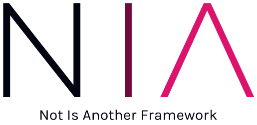

 

# Credits 🧑‍💻
Developed by David González [dgonzalez55](https://github.com/dgonzalez55/)

Latest Release: v0.2.0. January 16, 2023

License: MIT

This product is subject to the terms detailed in the license agreement.

If you have any questions, comments or concerns regarding NIA Framework, please consult the documentation prior to contacting one of the developers. Your feedback is always welcome. 

##  Contents 🧰

* About NIA
* Installation
* Configuration 

## About NIA ℹ

NIA is a lightweight PHP framework designed to provide an easy way to implement MVC web projects focusing in what really matters: the web application. 

With NIA, projects are not tied to a long list of dependencies or external libraries, neither you need to know a huge amount of different technologies. There is only one prerequisite: MVC web design pattern. If you are familiar with models, views, controllers and the common API web routing, then you already know the basis of NIA framework.

### Features
* Datasources management (full support: only MySQL).
* Sessions management.
* MVC management.
* Mail management through PHPMailer.
* Autoloader with composer support*.
* Easy configuration through app/config.php
* MVC routing through app/routes.php
* .htaccess template for easy deployment.
* Standard project folder hierarchy.

## Installation ⚙️

1. Fork/Clone/Download this repo

    `git clone https://github.com/dgonzalez55/NIA-Framework.git`

2. Navigate to the directory

    `cd NIA-Framework`

3. Download framework dependencies

    `composer update`

## Configuration 🛠

4. Edit config file
    
    `./app/config.php`
  
5. Start defining your endpoints and MVC classes

    Endpoints: `./app/routes.php`

    Controllers: `./app/controllers`

    Models: `./app/models`

    Views: `./app/views`
